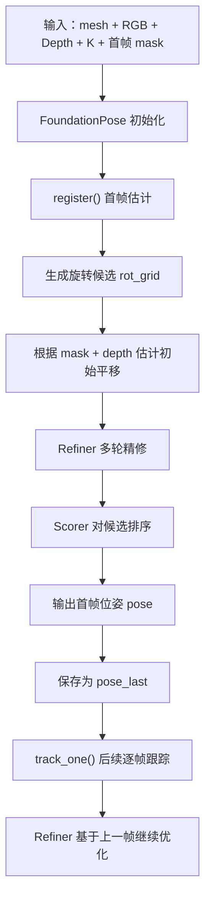

# FoundationPose 技术文档：使用、数据接入与结果调整

## 1. 文档目标

这份文档不是论文解读，而是基于你当前仓库 `FoundationPose-main` 的实际代码，回答 3 个更落地的问题：

1. 如何把现有 `FoundationPose` 功能真正跑起来。
2. 如果我要换成自己的物体和自己的数据，应该怎么接入。
3. 如果我想“增加数据集来调整结果”，当前仓库实际上支持到什么程度，以及推荐怎么做。

如果你现在的目标是先把一个自定义物体跑通，建议优先看：

- `run_demo.py`
- `estimater.py`
- `datareader.py`
- `learning/training/predict_pose_refine.py`
- `learning/training/predict_score.py`

## 2. 先说结论

从当前仓库代码看，`FoundationPose` 的公开主线是：

- 使用预训练好的 `refiner` 和 `scorer` 权重直接推理；
- 首帧做 `register()` 初始位姿估计；
- 后续帧做 `track_one()` 连续跟踪。

如果你想“增加数据集以调整结果”，有两条路线：

### 路线 A：不重新训练，只做工程层调整

这是最推荐你先走的路线，投入最小，收益通常也最直接：

- 换更准确的 mesh
- 提供更稳定的首帧 mask
- 保证深度图质量和相机内参准确
- 调整 refine 迭代次数
- 用更接近你场景的数据格式和采样方式

这类方式不需要重训网络，但经常能显著改善效果。

### 路线 B：增加数据并重新训练或微调

从当前仓库结构看，已经包含了：

- 网络结构
- 推理封装
- H5 数据集读取器
- 部分训练配置定义

但 **当前仓库里没有完整公开的训练启动脚本**。也就是说：

- 你可以明确看出它训练时依赖 H5 格式数据；
- 你也能看出 `refiner` / `scorer` 训练时需要哪些字段；
- 但如果你要真正做完整微调，还需要补训练 loop，或者引入上游未公开/未随仓库放出的训练脚本。

因此，现实建议是：

1. 先通过路线 A 把你的物体和场景跑通；
2. 如果仍不满足，再规划“补训练脚本 + 自建 H5 数据集”的路线。

## 3. 仓库里真正有用的主线

### 3.1 入口脚本

- `run_demo.py`：最适合接自定义单物体 RGB-D 视频
- `run_ycb_video.py`：面向 YCB-Video 数据集评测
- `run_linemod.py`：面向 LINEMOD 数据集评测

### 3.2 核心流程

核心控制器在 `estimater.py` 的 `FoundationPose` 类里，主要有两个方法：

- `register()`：首帧注册
- `track_one()`：后续帧跟踪

### 3.3 两个预训练网络

- `PoseRefinePredictor`：候选位姿精修
- `ScorePredictor`：候选位姿打分排序

它们默认加载固定权重目录：

- `weights/2023-10-28-18-33-37`：refiner
- `weights/2024-01-11-20-02-45`：scorer

### 3.4 数据读取层

`datareader.py` 负责把不同数据集统一成上层可直接使用的接口，例如：

- `get_color(i)`
- `get_depth(i)`
- `get_mask(i)`
- `K`

如果你想接自己的数据，最重要的改造点通常就在这里。

## 4. 这套系统实际怎么工作

你可以把整个推理链理解成下面这张流程图：



核心含义是：

- 首帧不知道物体姿态，所以要先“搜索 + 精修 + 排序”；
- 后续帧已经有上一帧结果，所以通常只需局部 refinement。

## 5. 你现在最适合的使用方式

如果你只是想把自己的目标物体跑起来，最简单、最稳的方式其实不是从 `run_ycb_video.py` 或 `run_linemod.py` 入手，而是直接仿照 `run_demo.py`。

原因很简单：

- `run_demo.py` 是单物体闭环，依赖最少；
- 它已经演示了“首帧注册 + 后续帧跟踪”；
- 自定义数据接入成本最低。

## 6. 自定义数据的最低接入要求

按照 `run_demo.py` + `YcbineoatReader` 的实现，你至少需要下面这些内容。

### 6.1 物体模型

你需要一个可加载的 mesh，例如：

- `obj`
- `ply`

仓库默认 demo 使用：

- `demo_data/mustard0/mesh/textured_simple.obj`

要求：

- mesh 尺度要和真实世界一致，单位通常应为米；
- mesh 坐标系要尽量合理，否则姿态看起来会“偏”。

### 6.2 RGB 图像

按帧存放，例如：

- `rgb/000000.png`
- `rgb/000001.png`

### 6.3 深度图

按 `YcbineoatReader.get_depth()` 的实现，默认读取：

- `depth/000000.png`

并且会做：

- `cv2.imread(...)/1e3`

这说明默认假设你的深度图原始单位是毫米，读取后转换成米。

### 6.4 相机内参

需要一个 `cam_K.txt`，内容是 `3x3` 内参矩阵。

### 6.5 首帧 mask

`run_demo.py` 在第 0 帧调用：

- `mask = reader.get_mask(0).astype(bool)`

也就是说，**首帧必须有目标分割 mask**，否则注册质量会明显下降，甚至无法正常初始化。

### 6.6 推荐目录结构

如果你想尽量少改代码，建议直接仿照 demo 数据组织：

```text
your_scene/
  cam_K.txt
  rgb/
    000000.png
    000001.png
    ...
  depth/
    000000.png
    000001.png
    ...
  masks/
    000000.png
    000001.png
    ...
  mesh/
    textured_simple.obj
```

这样你只需要把 `run_demo.py` 的参数改成你的路径即可。

## 7. 最小可运行方案

### 7.1 先准备权重

根据 `readme.md`，需要下载并放到 `weights/`：

- refiner：`2023-10-28-18-33-37`
- scorer：`2024-01-11-20-02-45`

### 7.2 先准备 demo 风格数据

保证你自己的数据目录满足上一节结构。

### 7.3 直接运行

可以使用类似方式：

```bash
python run_demo.py --mesh_file /path/to/your_scene/mesh/textured_simple.obj --test_scene_dir /path/to/your_scene --est_refine_iter 5 --track_refine_iter 2 --debug 1
```

### 7.4 输出结果看哪里

默认会输出到 `debug_dir`，主要包括：

- 每帧位姿：`debug/ob_in_cam/*.txt`
- 可视化图：`debug/track_vis/*.png`

## 8. 如果你想接自己的数据，优先有两种方式

## 方式一：完全复用 `YcbineoatReader`

这是最省事的方法。只要你把目录组织成它期待的样子，就不必自己写 reader。

适合场景：

- 单物体
- RGB-D 视频序列
- 能提供首帧或每帧 mask
- 能提供准确 `K`

## 方式二：自己在 `datareader.py` 新增一个 Reader

当你的数据组织方式和 demo 差异较大时，更推荐自己写一个 reader。

建议至少实现这些接口：

- `self.color_files`
- `self.K`
- `self.id_strs`
- `get_color(i)`
- `get_depth(i)`
- `get_mask(i)`

如果你希望兼容评测或更多自动化流程，还可以补：

- `get_gt_pose(i)`
- `get_xyz_map(i)`
- `get_occ_mask(i)`

一个最小 reader 的职责不是做复杂逻辑，而是把你的原始数据统一成上层需要的标准输入。

## 9. 如何把自定义数据接到 `run_demo.py`

你可以把 `run_demo.py` 当作一个模板。它做的事情是：

1. 读 mesh；
2. 初始化 `ScorePredictor`；
3. 初始化 `PoseRefinePredictor`；
4. 初始化 `FoundationPose`；
5. 用 reader 逐帧读 RGB-D；
6. 第 0 帧 `register()`；
7. 其余帧 `track_one()`。

如果你想自定义得更彻底，建议新建一个脚本，例如：

- `run_custom_demo.py`

其中保留这条核心结构即可：

```python
mesh = trimesh.load(mesh_file)
scorer = ScorePredictor()
refiner = PoseRefinePredictor()
glctx = dr.RasterizeCudaContext()

est = FoundationPose(
    model_pts=mesh.vertices,
    model_normals=mesh.vertex_normals,
    mesh=mesh,
    scorer=scorer,
    refiner=refiner,
    debug_dir=debug_dir,
    debug=debug,
    glctx=glctx,
)

reader = YourReader(scene_dir)

for i in range(len(reader.color_files)):
    color = reader.get_color(i)
    depth = reader.get_depth(i)
    if i == 0:
        mask = reader.get_mask(0).astype(bool)
        pose = est.register(K=reader.K, rgb=color, depth=depth, ob_mask=mask, iteration=5)
    else:
        pose = est.track_one(rgb=color, depth=depth, K=reader.K, iteration=2)
```

## 10. 哪些因素最影响结果

如果你现在关心的是“结果为什么不稳”或者“我应该优先改哪里”，优先级通常如下。

### 10.1 mesh 质量

影响非常大。

如果 mesh 有下面问题，结果常常会很差：

- 尺度不对
- 几何和真实物体不一致
- 坐标系偏移明显
- 法线异常

如果你有更高质量的 CAD 或重建模型，优先先替换 mesh，而不是马上考虑重训练。

### 10.2 首帧 mask 质量

`register()` 对首帧 mask 很敏感，因为它用 mask 做：

- 目标区域定位
- 深度有效区域过滤
- 初始平移估计

如果 mask 漏得多、粘连严重、目标只截到一部分，初始化就会偏。

### 10.3 相机内参 K

`K` 不准时，后面所有基于渲染对齐和裁剪的流程都会受影响。

一定要确认：

- 焦距准确
- 主点准确
- 分辨率变化后是否同步缩放了 `K`

### 10.4 深度图质量

这套方法明显依赖深度和几何信息。以下问题都会破坏效果：

- 深度缺失过多
- 深度单位错误
- 深度和 RGB 未对齐
- 物体表面反光导致深度噪声

### 10.5 refine 迭代次数

`run_demo.py` 里默认：

- `est_refine_iter=5`
- `track_refine_iter=2`

经验上：

- 首帧定位差时，可以适当提高 `est_refine_iter`
- 跟踪漂移时，可以适当提高 `track_refine_iter`

但它不是越大越好，过大只会更慢，不一定更稳。

### 10.6 检测方式

在 `run_ycb_video.py` / `run_linemod.py` 中，`detect_type` 支持：

- `mask`
- `box`
- 检测器生成的 mask

一般来说：

- 精准 mask > 框 > 粗糙检测结果

所以如果你是在自定义场景里使用，建议优先接一个稳定的实例分割结果，而不是只给 2D 框。

## 11. 结果调优时，建议你按这个顺序做

### 第 1 层：不改网络，只改输入质量

优先检查：

1. mesh 是否真实且尺度正确
2. `cam_K.txt` 是否正确
3. depth 单位是否为毫米并正确转换到米
4. RGB 与 depth 是否严格对齐
5. 首帧 mask 是否干净

这是最值得先做的一层，很多问题都出在这里。

### 第 2 层：调推理参数

建议重点尝试：

1. `est_refine_iter`
2. `track_refine_iter`
3. 输入图像分辨率
4. 你的数据采样策略

例如：

- 初始化难，可以提升 `est_refine_iter`
- 跟踪容易丢，可以提升 `track_refine_iter`
- 画面太大又很慢，可以做合理缩放，但要同步调整 `K`

### 第 3 层：换更适合你的对象表示

如果你的 CAD 很粗糙，而你能拍参考视图，那么可以考虑 model-free 分支，用 `bundlesdf/run_nerf.py` 先生成重建 mesh，再在 `run_ycb_video.py` / `run_linemod.py` 的 `--use_reconstructed_mesh 1` 路线上使用类似思路。

对你来说，这一层的本质是：

- 不一定是重训练网络；
- 也可以是把输入给网络的物体几何表示做得更接近真实物体。

## 12. “增加数据集”在当前仓库里到底是什么意思

这是最容易被误解的一点。

## 12.1 对推理来说，增加数据集有两种含义

### 含义 A：增加测试数据

这表示你只是把自己的场景数据接进来做推理，不涉及重训练。

这种情况下你只需要：

- 新增或复用一个 reader
- 提供 mesh / RGB / depth / K / mask
- 跑 `run_demo.py` 风格流程

### 含义 B：增加训练数据

这表示你想让网络更适配你的物体类型、材质、视角、遮挡和相机。

这就不只是“读数据”了，而是：

- 你要构造训练样本
- 你要准备训练格式
- 你要有训练 loop
- 你要重新导出新的权重

## 12.2 当前仓库对训练数据的直接线索

虽然训练脚本没完整公开，但从 `learning/datasets/h5_dataset.py` 可以明确看出：

- 训练数据被组织成 H5 文件；
- dataset 以 object key 为单位读取；
- 每个 object 下会有多个 `i_perturb` 样本；
- 会读取 `crop_ratio`、`H_ori`、`W_ori`；
- refiner 还依赖 `trans_normalizer`、`rot_normalizer`。

这意味着如果你未来要做自己的训练数据，方向应该是：

1. 先把你的训练样本整理成与现有 H5 读取逻辑兼容的格式；
2. 再补训练 loop 去调用 `RefineNet` 或 `ScoreNetMultiPair`。

## 13. 如果你要自己扩充训练数据，建议理解这几件事

### 13.1 refiner 训练想学什么

`PoseRefinePredictor` 推理时的输入本质上是：

- 当前候选位姿渲染出来的视图 A
- 真实观测裁剪出的视图 B
- 以及对应的几何信息 `xyz_map`

所以 refiner 训练样本本质上是在学：

- 给我一个“有误差的当前姿态”
- 我该如何预测一个更接近真值的位姿增量

也就是说，训练数据里必须体现“扰动后的姿态”和“真实姿态”的关系。

### 13.2 scorer 训练想学什么

scorer 学的是：

- 多个候选位姿中，哪个更靠谱

所以训练数据不是只有单个姿态，而通常是：

- 一个对象
- 多个扰动姿态
- 每个扰动姿态对应一个优劣标签或排序信号

### 13.3 数据越多不一定越有效

真正有价值的是“与你真实部署场景接近”的数据，例如：

- 相似视角范围
- 相似深度噪声
- 相似遮挡比例
- 相似光照和材质
- 相似相机参数

比起盲目加数据量，更应该优先提高数据分布匹配度。

## 14. 针对你的场景，推荐的数据扩充策略

如果你的目标是“让结果更稳”，建议按下面优先级推进。

### 方案 1：先做自己的推理集和回放集

先不要急着训练，先收集一批你自己的真实测试视频，覆盖：

- 正常视角
- 大角度视角
- 遮挡
- 快速运动
- 光照变化
- 远近距离变化

这批数据的价值是：

- 你能稳定复现实验；
- 你能判断改动是否真的带来收益。

### 方案 2：优先增强首帧初始化质量

如果实际失败主要发生在第一帧：

- 优先优化分割 mask
- 优先优化 mesh
- 优先检查深度和 K

因为后续跟踪依赖首帧初始化。

### 方案 3：建立你自己的 demo 数据规范

建议你在项目里专门维护一个目录规范，例如：

```text
custom_data/
  object_a/
    scene_01/
      cam_K.txt
      rgb/
      depth/
      masks/
      mesh/
```

这样后续你只需要换路径，不需要不断改 reader 逻辑。

### 方案 4：如果一定要训练，先做 H5 数据转换器

真正进入重训练前，第一步不是搭训练框架，而是先做一个脚本：

- 把你的原始 RGB-D + mask + pose + mesh 信息
- 转成与 `learning/datasets/h5_dataset.py` 相兼容的 H5 结构

这是因为：

- 训练 loop 可以后补；
- 但如果数据结构没先统一，后面所有工作都会反复推倒重来。

## 15. 当前仓库的限制，你需要提前知道

### 15.1 更偏推理仓库，不是完整训练仓库

当前代码明确支持：

- 预训练模型推理
- demo 和公开数据集评测
- model-free 的一部分流程

但并没有给出完整训练入口。

### 15.2 自定义数据接入是可行的

这一点没有问题，而且成本不高。你完全可以：

- 自己写 reader
- 自己写 `run_custom_demo.py`
- 用现有预训练权重做推理验证

### 15.3 真正微调需要额外工程补充

如果你的目标是“加入自己的数据后重新训练权重”，那还需要补这些内容：

- H5 数据构建脚本
- 训练 loop
- 验证集评估逻辑
- checkpoint 保存与加载规范

## 16. Windows 环境特别注意

你当前如果是 Windows 原生环境，需要额外注意。

### 16.1 官方更偏 Linux / Docker

`readme.md` 里推荐的是：

- Docker
- Conda

而且不少脚本默认按 Linux 习惯写。

### 16.2 `run_demo.py` 里有 Linux 风格命令

例如它会执行类似：

- 清空 `debug_dir`
- 创建输出目录

当前实现直接用的是 Linux 风格 shell 命令，Windows 原生 PowerShell 下不一定能正常跑。

因此更稳妥的建议是：

1. 优先在 Linux、WSL2 或 Docker 环境下运行；
2. 如果坚持在 Windows 原生环境下跑，需要把这些命令替换成 Python 的跨平台写法。

### 16.3 CUDA 扩展和渲染依赖也更偏 Linux

这个仓库依赖：

- nvdiffrast
- PyTorch3D
- 自定义 C++/CUDA 扩展

这些在 Windows 原生环境下通常更容易遇到编译或兼容性问题。

## 17. 一套最实用的落地方案

如果我是按“最少走弯路”的方式帮你推进，我会建议你这样做：

1. 先准备一个单物体、自定义 RGB-D 序列，目录完全仿照 demo。
2. 直接复用 `YcbineoatReader` 跑通 `run_demo.py`。
3. 确认 mesh、K、depth、mask 都正确后，再调 `est_refine_iter` 和 `track_refine_iter`。
4. 如果效果仍不稳，再决定是走：
   - 更高质量 mesh / 重建 mesh
   - 更强分割
   - 还是补训练与微调路线

## 18. 最后给你的判断建议

如果你的目标是：

### “先能用”

最优路线是：

- 不改网络
- 先接自己的 demo 风格数据
- 优先优化 mesh、mask、K、depth

### “让结果更稳”

最优路线是：

- 先建立自己的回放测试集
- 系统评估输入质量和参数
- 必要时换更接近真实物体的 mesh 或重建模型

### “让网络适配我的场景”

最优路线是：

- 先确认当前仓库没有完整训练入口
- 再规划 H5 数据转换 + 训练 loop 补全

## 19. 你接下来最值得做的事

如果你准备真正开始动手，建议优先完成下面 3 件事：

1. 按 demo 格式准备一个你自己的单物体数据目录。
2. 用现有预训练权重先跑通一遍完整流程。
3. 把失败样例按“mesh / mask / K / depth / 跟踪漂移”分类型记录。

这样你后面无论是继续调参数，还是决定是否进入重训练，都会非常清楚。
