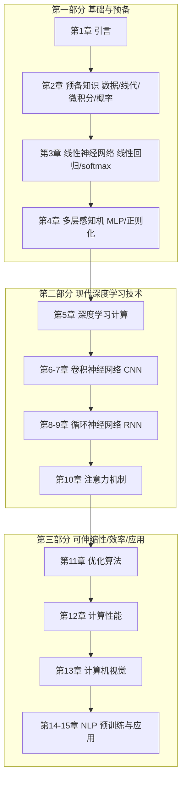

# 全书结构与各章主题

> 返回 [[学习地图MOC]] | 来源 [[前言精读]] | 个人学习顺序见 [[学习路径]]

## 一句话总结

**大白话**：全书像盖楼——先打地基（数学和最简单的模型），再砌主体（CNN、RNN、注意力这些主力结构），最后装修加扩展（怎么训得快、怎么落地到视觉和 NLP 应用）。后面的每一层都踩在前面之上。

**严谨说法**：全书大致分为三部分：**基础与预备 → 现代深度学习技术 → 可伸缩性、效率与应用**。每一部分都建立在前一部分之上，由浅入深。

## 三部分结构图

## 各部分详解

### 第一部分：基础知识和预备知识
| 章 | 主题 | 关键内容 | 笔记 |
| --- | --- | --- | --- |
| 1 | 引言 | 深度学习入门课程、动机与发展 | [[引言]] |
| 2 | 预备知识 | 数据存储与处理、线性代数、微积分、概率 | [[数据操作与预处理]]、[[线性代数]]、[[微积分与自动微分]]、[[概率与查阅文档]] |
| 3 | 线性神经网络 | 线性回归、softmax 回归（含从零与简洁实现） | [[线性回归]]、[[softmax回归]]、[[图像分类数据集]] |
| 4 | 多层感知机 | MLP、激活函数、过拟合与正则化（权重衰退、丢弃法）、分布偏移 | [[多层感知机]]、[[模型选择与过拟合]]、[[权重衰退]]、[[暂退法Dropout]]、[[数值稳定性与初始化]]、[[分布偏移]]、[[Kaggle房价预测]] |

### 第二部分：现代深度学习技术
| 章 | 主题 | 关键内容 | 笔记 |
| --- | --- | --- | --- |
| 5 | 深度学习计算 | 模型构造、参数管理、自定义层、读写文件、GPU | [[层和块]]、[[参数管理]]、[[自定义层]]、[[读写文件]]、[[GPU与设备管理]] |
| 6-7 | 卷积神经网络 | 卷积/池化、LeNet、AlexNet、VGG、ResNet 等——现代 CV 骨干 | [[从全连接到卷积]]、[[卷积填充与通道]]、[[汇聚层]]、[[LeNet]]、[[AlexNet-VGG-NiN]]、[[GoogLeNet]]、[[批量规范化]]、[[ResNet与DenseNet]] |
| 8-9 | 循环神经网络 | 序列建模、RNN/GRU/LSTM——时序与 NLP | [[序列模型]]、[[文本预处理与语言模型]]、[[循环神经网络RNN]]、[[通过时间反向传播BPTT]]、[[门控循环单元GRU]]、[[长短期记忆网络LSTM]]、[[深度与双向RNN]]、[[机器翻译与seq2seq]] |
| 10 | 注意力机制 | attention、Transformer，逐步取代 RNN | [[注意力提示与汇聚]]、[[注意力评分函数]]、[[Bahdanau注意力]]、[[多头注意力]]、[[自注意力与位置编码]]、[[Transformer]] |

### 第三部分：可伸缩性、效率和应用
| 章 | 主题 | 关键内容 | 笔记 |
| --- | --- | --- | --- |
| 11 | 优化算法 | SGD、动量、Adam、学习率调度等 | [[优化与凸性]]、[[梯度下降与SGD]]、[[动量法]]、[[AdaGrad与RMSProp]]、[[Adam]]、[[学习率调度器]] |
| 12 | 计算性能 | 影响训练速度的关键因素、混合精度、多 GPU | [[编译器与异步计算]]、[[自动并行与硬件]]、[[多GPU训练]] |
| 13 | 计算机视觉 | 目标检测、语义分割等主要 CV 应用 | [[图像增广]]、[[微调]]、[[目标检测与锚框]]、[[多尺度检测与SSD]]、[[R-CNN系列]]、[[语义分割与FCN]]、[[风格迁移]] |
| 14-15 | NLP | 预训练语言表示（如 BERT）及下游任务应用 | [[词嵌入word2vec]]、[[近似训练与GloVe]]、[[子词嵌入与相似性]]、[[BERT模型与预训练]]、[[情感分析]]、[[自然语言推断]]、[[微调BERT下游任务]] |

## 依赖关系要点

- 第 2 章是后续一切的数学/张量基础。
- 第 3-4 章的「从零 + 简洁」双实现是理解后续所有模型的模板 → [[概念-在实践中学习]]。
- CNN/RNN/注意力是三大主流架构家族，注意力是通往现代大模型的关键。

## 和真实项目的连接

- CNN 章 → 视觉骨干特征提取，对应 DINOv3 等表示学习仓库。
- 注意力章 → Transformer 编码器、多模态骨干。
- 优化/计算性能章 → 真实训练中的学习率调度、显存与速度调优。

## 复习卡片

- Q: 全书哪三部分？
  A: 基础与预备、现代深度学习技术、可伸缩性/效率/应用。
- Q: 三大主流架构家族是？
  A: CNN、RNN、注意力 (Transformer)。
- Q: 哪一章为后续所有数值运算打基础？
  A: 第 2 章 预备知识。

## 标签

#d2l #structure #deep-learning #pytorch
