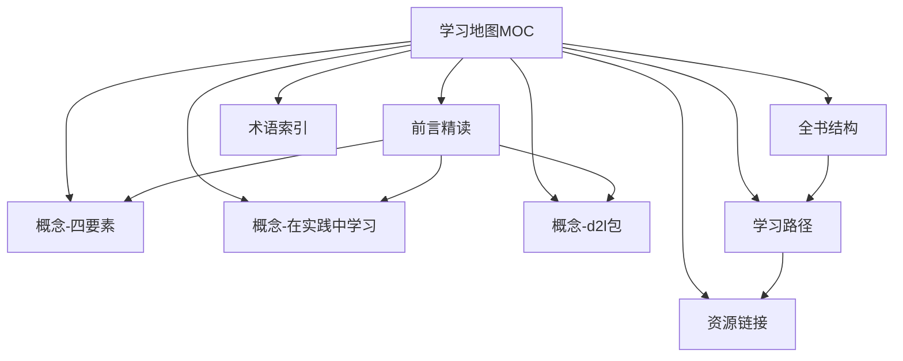
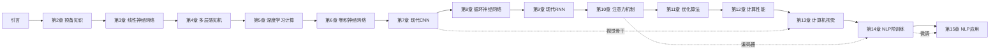

# D2L 学习地图 (Index MOC)

> Map of Content（内容地图）。本笔记是整套《动手学深度学习》(D2L) 学习笔记的中心枢纽。
> 所有概念笔记都从这里发散，并回链到本页。建议在 Obsidian 中以本文件为起点浏览关系图谱。

- 课本主页: https://zh.d2l.ai/
- 当前覆盖章节: 前言 + 全书 1-15 章按概念/节拆分的精读笔记
- 框架约定: **仅 PyTorch + 纯 Python 脚本环境**（不使用其他框架，不依赖 Jupyter）

---

## 笔记导航

### 前言精读
- [[前言精读]] — 《前言》逐节精读与核心思想

### 核心概念
- [[概念-四要素]] — 应用深度学习的四要素（动机 / 数学 / 优化 / 工程）
- [[概念-在实践中学习]] — "在实践中学习" 与 "从零实现 vs 简洁 API 双版本"
- [[概念-d2l包]] — `d2l` 包、`#@save` 机制与 PyTorch 标准导入

### 全书与路径
- [[全书结构]] — 全书三部分结构与各章主题
- [[学习路径]] — 学习路径规划 + 重点 / 难点标注
- [[资源链接]] — 资源链接与扩展阅读

### 术语图谱
- [[术语索引]] — 全书通用术语的中心枢纽（`术语/` 文件夹，跨章节复用互链）

---

## 全书章节中枢（先到章中枢，再进入各节笔记）

> 导航采用两级结构：本页 → 每章「中枢笔记」→ 各节笔记。这样关系图谱会形成清晰的章节簇，而不是一颗以本页为中心的星。

### 第一部分：基础与预备
- [[引言]]
- [[第2章-预备知识]]
- [[第3章-线性神经网络]]
- [[第4章-多层感知机]]

### 第二部分：现代深度学习技术
- [[第5章-深度学习计算]]
- [[第6章-卷积神经网络]]
- [[第7章-现代CNN]]
- [[第8章-循环神经网络]]
- [[第9章-现代RNN]]
- [[第10章-注意力机制]]

### 第三部分：可伸缩性、效率与应用
- [[第11章-优化算法]]
- [[第12章-计算性能]]
- [[第13章-计算机视觉]]
- [[第14章-NLP预训练]]
- [[第15章-NLP应用]]

---

## 双链关系图

## 全书章节脉络图（章中枢层级）

---

## 如何使用这套笔记

1. 先读 [[前言精读]] 建立全局认知。
2. 顺着前言中的链接深入三个核心概念笔记。
3. 用 [[全书结构]] 理解全书脉络，再用 [[学习路径]] 制定个人学习计划。
4. 复习时直接看每篇末尾的「复习卡片」做主动回忆 (active recall)。

## 标签

#d2l #deep-learning #moc #pytorch
