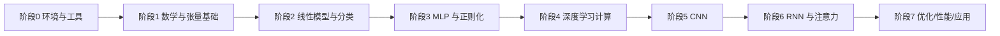

# 学习路径规划与重点 / 难点标注

> 返回 [[学习地图MOC]] | 全书结构见 [[全书结构]]

## 一句话总结

**大白话**：照着「先打基础、再学主力模型、最后谈优化与应用」的顺序走，每个模型都先自己手搓一遍、再用框架写一遍，复习时用「合上书自己回想」的方式查漏。

**严谨说法**：按「预备知识 → 线性/softmax → MLP → 计算 → CNN → RNN → 注意力 → 优化/性能 → 应用」的顺序推进，每个模型都先做**从零实现**再做**简洁实现**，配合主动回忆复习。

## 推荐学习顺序

## 分阶段计划与重难点

> 标注图例：★ 重点（高频考点/高频使用） | ⚠ 难点（易错或抽象）

### 阶段 0：环境与工具
- 内容：安装 PyTorch + `d2l`，确认 CUDA。→ [[概念-d2l包]]、[[资源链接]]
- ★ 统一 PyTorch 导入约定；⚠ CUDA / torch 版本匹配。

### 阶段 1：数学与张量基础（第 2 章）
- 内容：数据操作、线性代数、微积分、自动微分、概率。
- ★ 广播机制、张量形状、`autograd` 求导；⚠ 广播规则、梯度的几何含义。
- 笔记：[[数据操作与预处理]]、[[线性代数]]、[[微积分与自动微分]]、[[概率与查阅文档]]

### 阶段 2：线性模型与分类（第 3 章）
- 内容：线性回归、softmax 回归（从零 + 简洁）。
- ★ 损失函数、SGD 训练循环、softmax 数值稳定性；⚠ 交叉熵与 logits 的数值稳定实现。
- 现有代码：`d2l/code/3.6SoftMax回归从零开始实现.py`、`d2l/code/3.7SoftMax回归简洁实现.py`
- 笔记：[[线性回归]]、[[softmax回归]]、[[图像分类数据集]]

### 阶段 3：MLP 与正则化（第 4 章）
- 内容：多层感知机、激活函数、过拟合、权重衰退、丢弃法、分布偏移。
- ★ 激活函数选择、过拟合诊断；⚠ 权重衰退 vs 丢弃法的作用机制差异。
- 现有代码：`d2l/code/4.1多层感知机.py` 等 4.x 系列脚本。
- 笔记：[[多层感知机]]、[[模型选择与过拟合]]、[[权重衰退]]、[[暂退法Dropout]]、[[数值稳定性与初始化]]、[[分布偏移]]、[[Kaggle房价预测]]

### 阶段 4：深度学习计算（第 5 章）
- 内容：模型构造、参数管理、自定义层、GPU。
- ★ `nn.Module` 机制、参数初始化、设备管理；⚠ 自定义层/块的前向与参数注册。
- 笔记：[[层和块]]、[[参数管理]]、[[自定义层]]、[[读写文件]]、[[GPU与设备管理]]

### 阶段 5：CNN（第 6-7 章）
- 内容：卷积、池化、经典网络 (LeNet/AlexNet/VGG/ResNet)。
- ★ 卷积输出形状计算、感受野、残差连接；⚠ 形状推导、padding/stride。
- 笔记：[[从全连接到卷积]]、[[卷积填充与通道]]、[[汇聚层]]、[[LeNet]]、[[AlexNet-VGG-NiN]]、[[GoogLeNet]]、[[批量规范化]]、[[ResNet与DenseNet]]

### 阶段 6：RNN 与注意力（第 8-10 章）
- 内容：序列建模、RNN/GRU/LSTM、注意力与 Transformer。
- ★ 时序反向传播、注意力打分；⚠ 梯度消失/爆炸、自注意力的 QKV 维度。
- 笔记：[[序列模型]]、[[文本预处理与语言模型]]、[[循环神经网络RNN]]、[[通过时间反向传播BPTT]]、[[门控循环单元GRU]]、[[长短期记忆网络LSTM]]、[[深度与双向RNN]]、[[机器翻译与seq2seq]]、[[注意力提示与汇聚]]、[[注意力评分函数]]、[[Bahdanau注意力]]、[[多头注意力]]、[[自注意力与位置编码]]、[[Transformer]]

### 阶段 7：优化 / 性能 / 应用（第 11-15 章）
- 内容：优化算法、计算性能、CV、NLP 预训练与应用。
- ★ 学习率调度、混合精度、预训练-微调范式；⚠ 多 GPU、大模型显存管理。
- 笔记：[[优化与凸性]]、[[梯度下降与SGD]]、[[动量法]]、[[AdaGrad与RMSProp]]、[[Adam]]、[[学习率调度器]]、[[编译器与异步计算]]、[[自动并行与硬件]]、[[多GPU训练]]、[[图像增广]]、[[微调]]、[[目标检测与锚框]]、[[多尺度检测与SSD]]、[[R-CNN系列]]、[[语义分割与FCN]]、[[风格迁移]]、[[词嵌入word2vec]]、[[近似训练与GloVe]]、[[子词嵌入与相似性]]、[[BERT模型与预训练]]、[[情感分析]]、[[自然语言推断]]、[[微调BERT下游任务]]

## 学习方法建议

- 每个模型坚持「从零 + 简洁」两遍 → [[概念-在实践中学习]]。
- 学完一节就填写该节笔记的「复习卡片」，用主动回忆代替反复阅读。
- 时刻对照四要素自检：动机/数学/优化/工程是否都理解了 → [[概念-四要素]]。

## 复习卡片

- Q: 学习一个新模型的标准两步法？
  A: 先从零实现，再用框架简洁实现。
- Q: 第 2 章为什么排在最前？
  A: 它是张量、自动微分、概率等一切后续运算的基础。
- Q: CNN 阶段最容易出错的点？
  A: 卷积输出形状推导（padding / stride / kernel）。

## 标签

#d2l #roadmap #learning-path #pytorch
