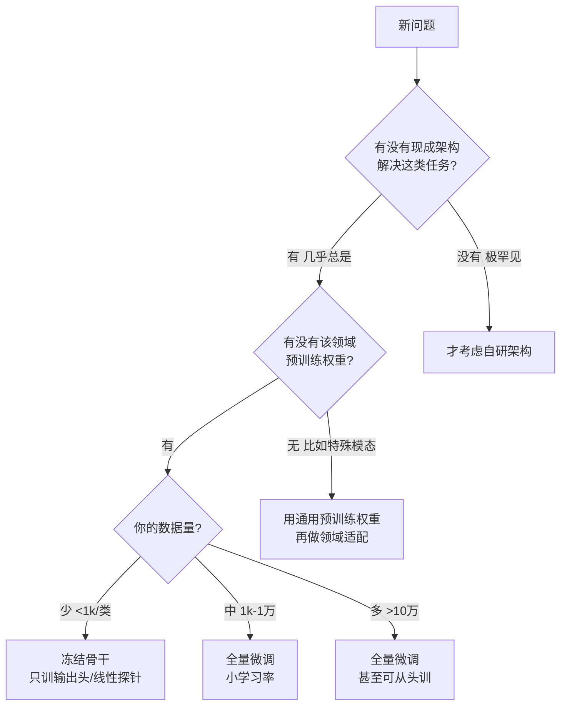

# 建模方法论：面对新问题如何设计与构建模型

> **怎么读这篇**：这不是某一节书的笔记，而是一篇**跨章节的工程方法论中枢**——把"遇到一个陌生任务（如视觉检测、表格回归、文本分类）该怎么动手"沉淀成可照搬的决策流程。配套实战见 `d2l/code/4.10实战kaggle比赛预测房价.py` 与 [[Kaggle房价预测]]。

## 一句话总结

**大白话**：现代深度学习里，你几乎**永远不从零设计架构、也不从零训练**。正确姿势是"**拿现成的强架构 + 预训练权重，用你的数据微调**"——站在巨人肩膀上。从零自研只属于极少数前沿研究或输入模态全新的特殊场景。

**严谨说法**：优先级是 **复用现成架构 > 改造现成架构 > 自研架构**，以及 **微调预训练 > 从零训练**。架构与预训练权重是全球海量算力/数据的产物，小数据无法复现其底层通用表征，故迁移复用是工程落地的默认范式（[[微调]]）。

## 本节解决的问题

- 遇到新任务，应该自研模型还是用现成的？自己设计架构还是用现有架构？
- 该从零训练还是微调？微调到什么程度（冻结 / 全量）？
- 怎样一步步从基线迭代到一个"合适"的模型，而不是上来堆大网络？

---

## 核心：建模决策树

## 三个层面的"复用 vs 自研"

### 1. 架构层面：优先用现成的
- **视觉检测**：直接选成熟框架——`YOLO`(v8/v11，快、工程友好)、`RT-DETR`(端到端、免 NMS)、`DETR/DINO`(精度高)。这些是 [[R-CNN系列]]、[[多尺度检测与SSD]] 的现代演进。
- **分类/分割/NLP** 同理：ResNet/ViT、UNet/SegFormer、BERT/LLM 都有成熟实现与权重。
- **自研架构的代价**：要重新调通收敛、复现各种 trick，通常数月起步且大概率打不过开源基线。**除非输入根本不是标准图像/文本**（点云、多光谱、雷达回波等），否则别自研。

### 2. 权重层面：优先微调（[[微调]]）

| 数据量 | 策略 | 说明 |
|---|---|---|
| 极少 (<几百/类) | **线性探针 / 冻结骨干** | 骨干当特征提取器，只训输出头 |
| 少到中 | **全量微调 + 小学习率** | 解冻全部，骨干用更小 lr（分层学习率） |
| 大 (>10万) | **全量微调，甚至从头训** | 数据足够才有资格"从零训练" |

> 输入归一化必须与预训练一致，否则特征分布错位（见 [[微调]] 易错点）。

### 3. "自己构建"通常只改局部适配件
真正要动手设计的，往往**不是整个架构，而是接口件**：
- **输入适配层**：如 4 通道多光谱 → 改第一层 conv。
- **输出头**：你的类别数 / 旋转框 / 关键点。
- **领域模块**：小目标加 FPN 层、加注意力等。
- 只有任务范式全新、无任何框架覆盖时，才从零设计——那是研究工作，不是落地起点。

---

## 通用建模六步套路（换任何任务都按这六步）

| 步骤 | 做什么 | 关键问题 |
|---|---|---|
| 1 定义任务与指标 | 明确预测什么、用什么指标 | 检测用 mAP？回归用对数 RMSE？ |
| 2 数据先行 | 标注、划分 train/val/test、保证分布一致 | 训练/部署分布是否一致？([[分布偏移]]) |
| 3 最简基线 | 现成小模型 + 预训练权重，跑通端到端 | 先拿到"分数下限" |
| 4 诊断 | 看 train vs val 差距定方向 | 欠拟合还是过拟合？ |
| 5 逐步加复杂度 | 换更大骨干/加模块/调超参，每步验证 | 这步真的变好了吗？ |
| 6 针对性优化与部署 | 小目标/类不均/速度/显存权衡 | 精度 vs 速度 vs 成本 |

### 第 4 步诊断口诀（最关键）
- **train 高、val 也高 → 欠拟合** → 加容量 / 减正则 / 多训 / 换更大模型。
- **train 低、val 高 → 过拟合** → 数据增广([[图像增广]])、加正则([[权重衰退]]、[[暂退法Dropout]])、减容量、加数据。
- **train/val 都好但线上崩 → 分布偏移**（[[分布偏移]]），不是过拟合，需数据治理/持续监控。

---

## 实证教训：模型不是越大越好

来自 [[Kaggle房价预测]] 的 K 折扫参（同数据同流程，只改模型/正则）：

| 配置 | valid log-RMSE | 现象 |
|---|---|---|
| `[256,64]` + BN + 强正则 | 0.32 | 欠拟合 |
| `[256,64]` + BN + 弱正则 | 0.45 | 严重过拟合（预测爆到 196 万） |
| **`[64]` 无BN + 适中 L2** | **0.15** | 简单稳健，最终采用 |

> **核心**：**模型容量要匹配数据规模**。小数据 + 高维稀疏特征上，更深更宽 + BatchNorm 反而有害。先建简单基线，再用交叉验证逐步加复杂度。

## 易错点

- 上来就自研架构 / 从头训练，浪费数月还打不过开源基线。
- 数据少却硬上大模型，过拟合且不稳。
- 微调时输入归一化与预训练不一致。
- 把线上性能下降一律当过拟合，忽略了 [[分布偏移]]。
- 只看一次划分调参，不用交叉验证，被运气误导。
- 重模型轻数据：检测里"数据质量 + 增广"的收益常大于换架构。

## 和前后章节 / 真实项目的连接

- 实战落地：[[Kaggle房价预测]]（表格回归的完整六步示例）。
- 迁移与微调：[[微调]]、[[迁移学习]]、[[微调BERT下游任务]]。
- 视觉检测架构谱系：[[R-CNN系列]]、[[多尺度检测与SSD]]、[[目标检测与锚框]]。
- 部署前必查：[[分布偏移]]（训练/部署分布不一致）。
- 工程化搭模型：[[层和块]]、[[参数管理]]、[[自定义层]]、[[参数初始化]]。
- 调参与泛化基础：[[模型选择与过拟合]]、[[权重衰退]]、[[暂退法Dropout]]、[[批量规范化]]。

## 复习卡片

- Q: 新问题第一反应应该是什么？
  A: 找现成架构 + 预训练权重微调，而非自研/从头训。
- Q: 数据极少怎么用预训练模型？
  A: 冻结骨干当特征提取器，只训输出头（线性探针）。
- Q: 什么时候才考虑自研架构？
  A: 输入模态全新、无任何现成框架覆盖时（极罕见）。
- Q: train 低 val 高怎么办？
  A: 过拟合——加正则/增广/减容量/加数据。
- Q: 线下好线上崩、又不是过拟合，最可能是？
  A: 分布偏移。

## 术语

- [[迁移学习]]、[[过拟合]]、[[正则化]]、[[学习率]]、[[参数初始化]]、[[泛化误差]]

## 标签

#d2l #pytorch #methodology #fam/工程
